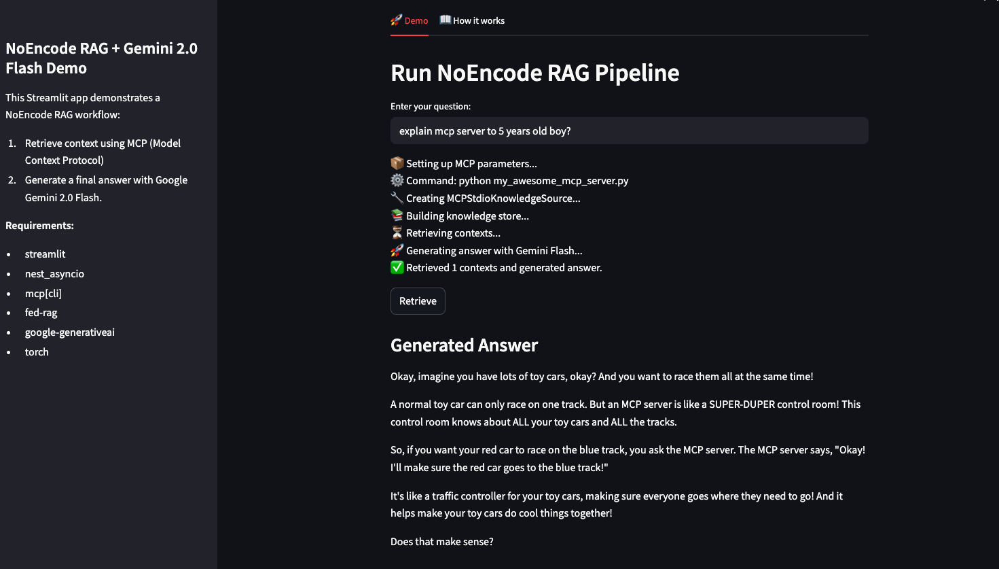
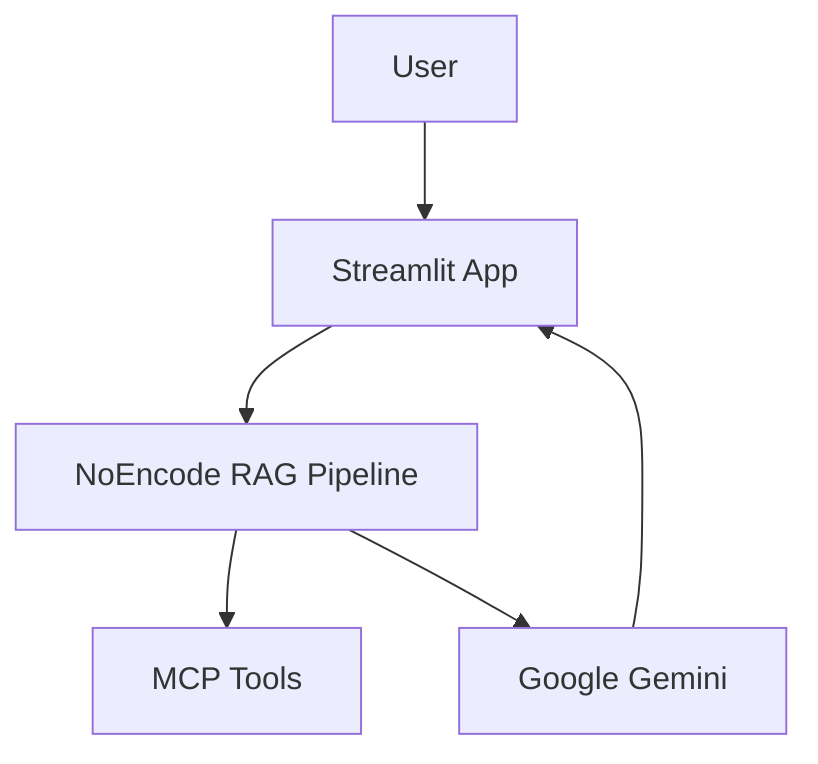
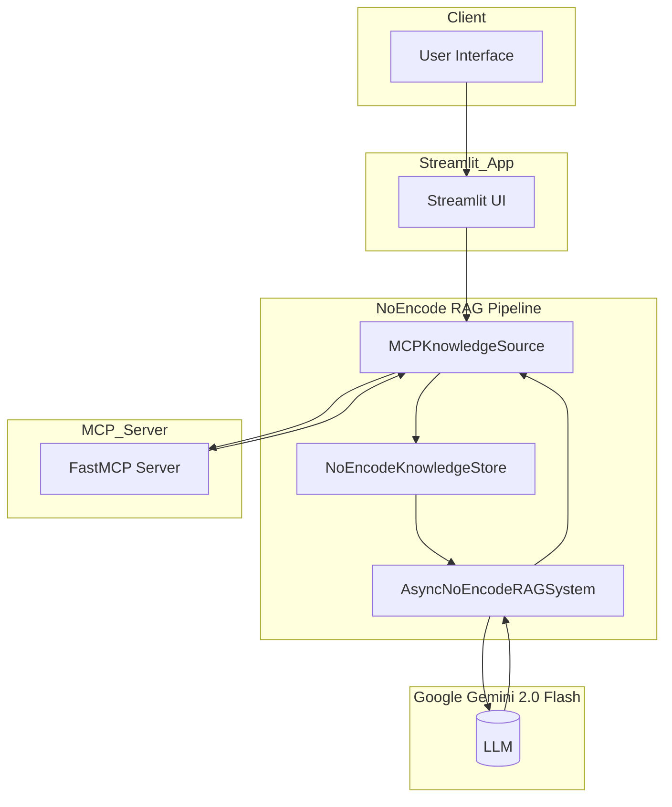
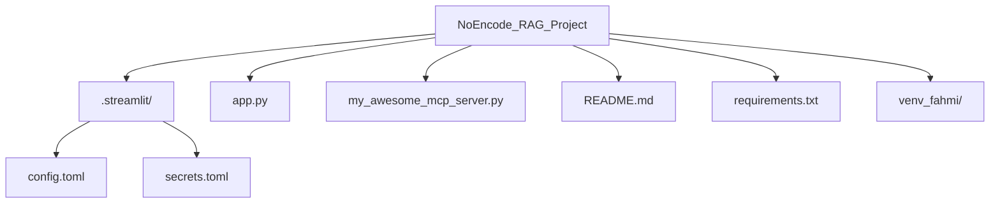

# NOENCODE_RAG_PROJECT

**Empowering Rapid Knowledge Access Through Seamless AI Integration**

---

<p align="center">
  
  
  
</p>

## Built With

- **Markdown** • **Streamlit** • **FastAPI** • **Python** • **Google Gemini**
- **FedRAG** • **Model Context Protocol (MCP)** • **nest_asyncio**

---

## Overview

This project demonstrates **NoEncode Retrieval-Augmented Generation (RAG)** powered by Anthropic’s Model Context Protocol (MCP) and Google Gemini 2.0 Flash. Unlike traditional RAG, NoEncode retrieves natural-language context directly—no embedding or retriever model required—then generates answers using an LLM.

# Overview Photo




---

## Features

- **NoEncode Retrieval:** Query any tool or API using plain text via MCP.
- **Seamless AI Generation:** Generate concise answers with Google Gemini 2.0 Flash.
- **Interactive UI:** Built with Streamlit for rapid prototyping.
- **Extensible Server:** Plug in any external system (DB, API, document store) as an MCP tool.

---

## Architecture



---

## Project Structure



---

## Installation

1. **Clone the repository**:
   ```bash
   git clone https://github.com/yourusername/NoEncode_RAG_Project.git
   cd NoEncode_RAG_Project
   ```
2. **Create & activate virtual environment**:
   ```bash
   python3 -m venv .venv
   source .venv/bin/activate  # macOS/Linux
   ```
3. **Install dependencies**:
   ```bash
   pip install -r requirements.txt
   ```
4. **Configure secrets** (`.streamlit/secrets.toml`):
   ```toml
   GEMINI_API_KEY = "<your_gemini_key>"
   ```

---

## Usage

1. **Run the MCP server**:
   ```bash
   python3 my_awesome_mcp_server.py
   ```
2. **Start the Streamlit app**:
   ```bash
   streamlit run app.py --server.fileWatcherType none
   ```
3. **Interact** in the UI:
   - **Demo** tab: enter your question and click **Retrieve**.
   - **How it works** tab: explore workflow and server examples.

---

## Server Examples

### Dummy Server (FAQ Only)
```python
from mcp.server.fastmcp import FastMCP

mcp = FastMCP("DemoServer")

@mcp.tool(name="KnowledgeTool")
def knowledge_tool(query: str) -> list[str]:
    q = query.strip().lower()
    if "what is mcp" in q:
        return ["MCP (Model Context Protocol) is Anthropic’s open standard for invoking tools..."]
    return ["Error: Unsupported query."]

if __name__ == "__main__":
    mcp.run()
```

### Production Example (Database)
```python
from mcp.server.fastmcp import FastMCP
import psycopg2

mcp = FastMCP("DatabaseServer")

@mcp.tool(name="CustomerLookup")
def customer_lookup(query: str) -> list[str]:
    conn = psycopg2.connect("dbname=crm user=admin")
    cur = conn.cursor()
    cur.execute("SELECT notes FROM customers WHERE id = %s", (query,))
    return [row[0] for row in cur.fetchall()]

if __name__ == "__main__":
    mcp.run()
```

---

## Requirements

```text
streamlit
nest_asyncio
mcp[cli]
fed-rag
google-generativeai
torch
```

---

## License

MIT © 2025 Fahmi Zainal
